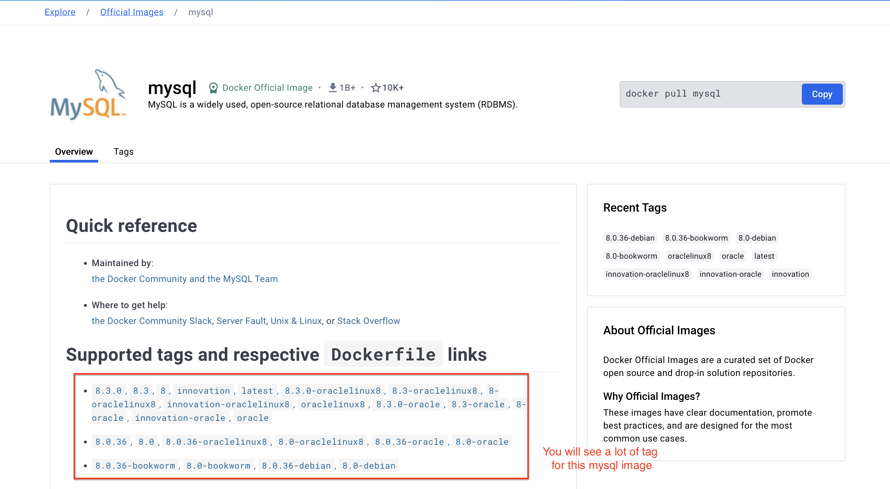
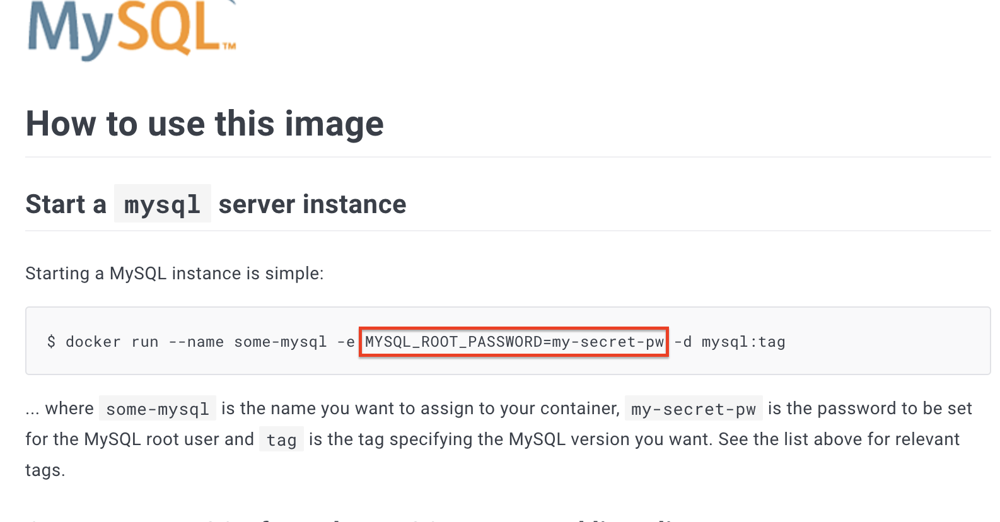
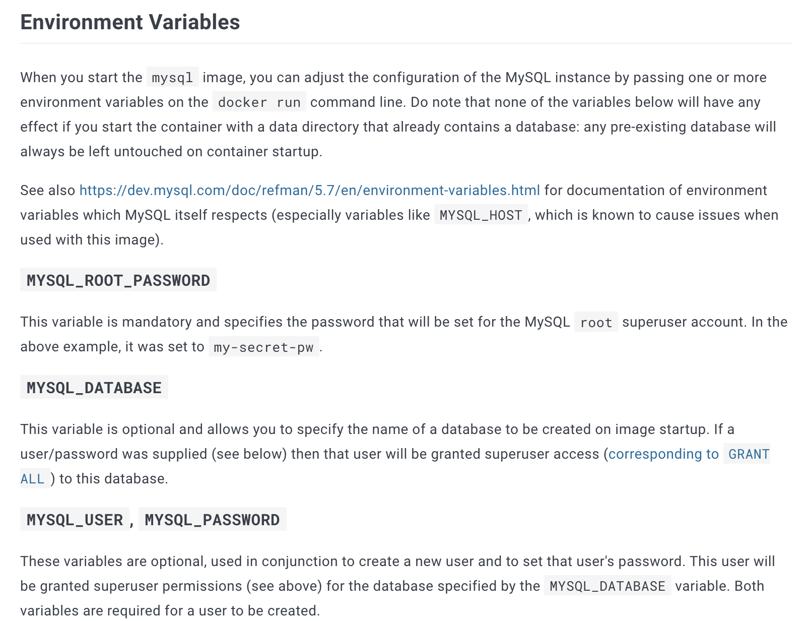
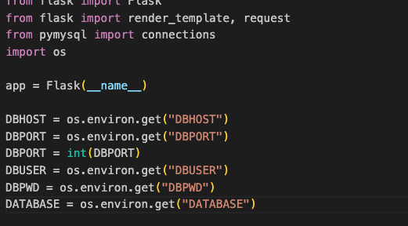
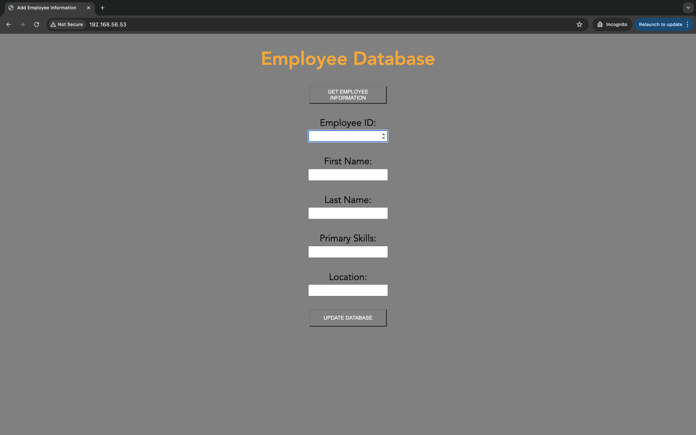
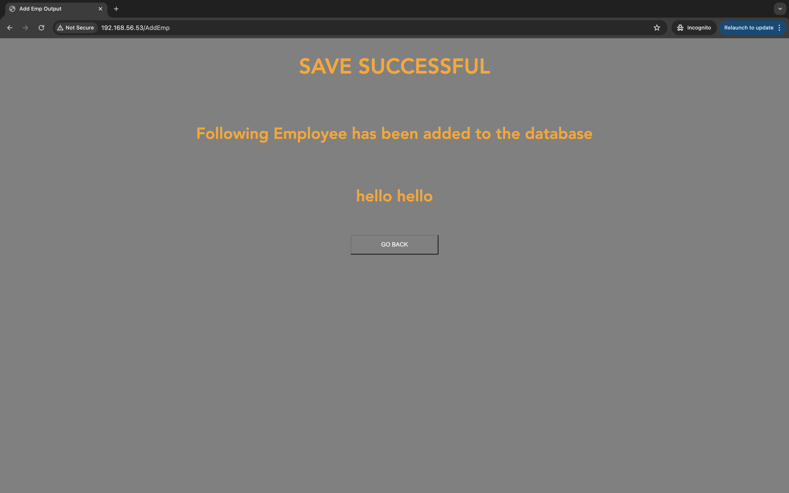
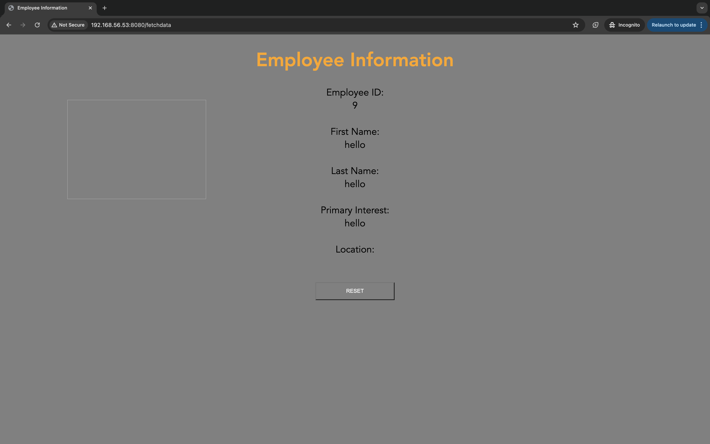
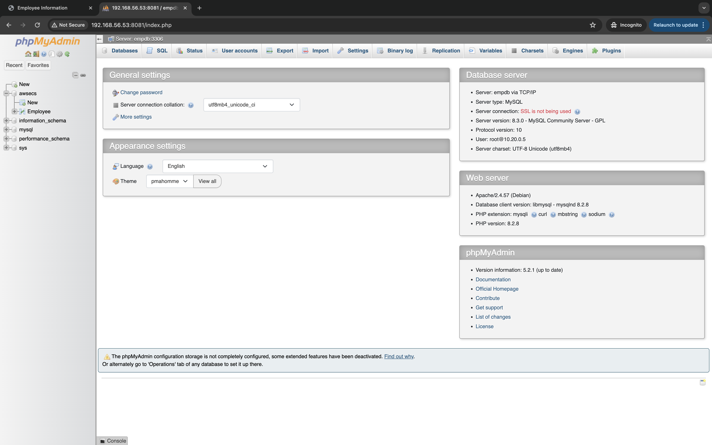

# 

Now we will create two tier application. In our application, there are two pages(insert employee, edit employee) and one database(mysql container).

First we will create mysql container.

Create docker network the name aws-ecs  with driver bridge. Because our application need to run over the same network.

```coffeescript
docker network create --attachable -d bridge --subnet=10.20.0.0/16 aws-ecs
```

We will pull mysql image from docker hub. So we will go through the following link. 

[mysql - Official Image | Docker Hub](https://hub.docker.com/_/mysql)



There are a lot of tag with configurations. You can use your desire environment. But, now we will use latest tag for our application.



```coffeescript
docker run --name some-mysql -e MYSQL_ROOT_PASSWORD=my-secret-pw -d mysql:tag
```

<aside>
💡 -e,--env → set environment variable

</aside>

In the documentation, to start mysql container, we need to run with `-e MYSQL_ROOT_PASSWORD={your_desire_password}` . This is the environment variable of mysql image. You can find more about the environment variable to configure of Mysql instance in `Environment Variables` section of documentation. 



We will create new directory to bind with the mysql volume.

```coffeescript
cd ~
cd ecs-cop
mkdir ecs2
```

```coffeescript
docker run -d -e MYSQL_ROOT_PASSWORD=abcd1234 --name empdb --net aws-ecs -p 3306:3306 mysql:latest
```

After create mysql container, we will check that container running or not.

```coffeescript
docker ps
#OUTPUT
CONTAINER ID   IMAGE          COMMAND                  CREATED         STATUS        PORTS                                                  NAMES
24d18b7990cf   mysql:latest   "docker-entrypoint.s…"   2 seconds ago   Up 1 second   0.0.0.0:3306->3306/tcp, :::3306->3306/tcp, 33060/tcp   empdb
```

And we will create database and tables inside that mysql container instance. 

Go inside the mysql container and we will use bash and login to mysql with `mysql -u root -p` . And type your password that we defined as `-e MYSQL_ROOT_PASSWORD=abcd1234` .

```coffeescript
docker exec -it empdb /bin/bash
bash-4.4# mysql -u root -p 
Enter password: 
Welcome to the MySQL monitor.  Commands end with ; or \g.
Your MySQL connection id is 8
Server version: 8.3.0 MySQL Community Server - GPL

Copyright (c) 2000, 2024, Oracle and/or its affiliates.

Oracle is a registered trademark of Oracle Corporation and/or its
affiliates. Other names may be trademarks of their respective
owners.

Type 'help;' or '\h' for help. Type '\c' to clear the current input statement.

mysql>
```

We will create database and tables as the following.

```coffeescript
mysql> create database awsecs;
Query OK, 1 row affected (0.01 sec)

mysql> use awsecs;
Database changed
mysql> create table Employee (emp_id integer,first_name varchar(40),last_name varchar(40),primary_skills varchar(20),location char(10));
Query OK, 0 rows affected (0.03 sec)

mysql> show tables;
+------------------+
| Tables_in_awsecs |
+------------------+
| Employee         |
+------------------+
1 row in set (0.01 sec)

mysql> describe Employee;
+----------------+-------------+------+-----+---------+-------+
| Field          | Type        | Null | Key | Default | Extra |
+----------------+-------------+------+-----+---------+-------+
| emp_id         | int         | YES  |     | NULL    |       |
| first_name     | varchar(40) | YES  |     | NULL    |       |
| last_name      | varchar(40) | YES  |     | NULL    |       |
| primary_skills | varchar(20) | YES  |     | NULL    |       |
| location       | char(10)    | YES  |     | NULL    |       |
+----------------+-------------+------+-----+---------+-------+
5 rows in set (0.00 sec)
```

Now we have created Employee table. And exit from mysql and container.

```coffeescript
mysql> exit;
Bye
bash-4.4# exit
exit
```

After creating database container, we need to start to deploy our application. So please download the source code from the following github link.

[https://github.com/htetwaiyan/docker_employee_app](https://github.com/htetwaiyan/docker_employee_app)

In the source code, there will be two projects, one is `AddEmp` and another is `GetEmp` .

We will create container for each project(web page).

First, we gonna explore a little bit of about docker file under `AddEmp` folder.

```coffeescript
FROM ubuntu:18.04
```

The first line is `FROM` , which means we will use `ubuntu:18.04` as base image.

```coffeescript
RUN apt-get update -y && apt-get install -y python3 python3-pip
```

Second line, now we are creating python web app, so we need to install the required python tools.

```coffeescript
COPY ./requirements.txt /app/addemp/requirements.txt
```

Copy the `requirements.txt` file to `/app/addemp/requirements.txt` .

```coffeescript
WORKDIR /app/addemp
```

Define the `/app/addemp`  as working directory.

```coffeescript
RUN pip3 install -r requirements.txt
```

Run to install the dependencies which are required to run web app. (pre-write all dependencies in requirements.txt)

```coffeescript
COPY ./AddEmp.py /app/addemp/AddEmp.py
COPY ./templates/AddEmp.html /app/addemp/templates/AddEmp.html
COPY ./templates/AddEmpOutput.html /app/addemp/templates/AddEmpOutput.html
```

And Copy all source code under `/app/addemp` (the working directory).

```coffeescript
EXPOSE 80
```

This container will expose port 80.

```coffeescript
ENTRYPOINT ["python3", "AddEmp.py"]
```

`ENTRYPOINT` sets the default command that executes when a container starts from an image. So it will run `python3 AddEmp.py` , when container starts.

Now let’s build image for `AddEmp` first.

```coffeescript
$ ls
#OUTPUT
AddEmp  GetEmp  README.md
```

Go under the folder where you would like to build image.

```coffeescript
$cd AddEmp
/AddEmp$ ls
AddEmp.py  Dockerfile  requirements.txt  templates
```

And run build image with tag `addemp` .

```coffeescript
$ docker build -t addemp .
```

And check with `docker images` .

```coffeescript
$ docker images
#OUTPUT
REPOSITORY              TAG       IMAGE ID       CREATED        SIZE
addemp                  latest    63593ba49dc5   7 days ago     499MB
```

And run with image as a container.

```coffeescript
docker run -d -e DBHOST="empdb" -e DBPORT="3306" -e DBUSER="root" -e DBPWD="abcd1234" -e DATABASE="awsecs" --name addemp --net aws-ecs -p 80:80 addemp:latest
```

<aside>
💡 `-e` option define environment variable inside that running container image. Because we are using the environment variables inside the source code.

</aside>



<aside>
💡 `--net`  option define where that container need to run. In this case, our container need to run  under the same network with the mysql container.

</aside>

```coffeescript
$ docker ps
#OUTPUT
CONTAINER ID   IMAGE           COMMAND                  CREATED         STATUS         PORTS                                                  NAMES
df573b1e59bb   addemp:latest   "python3 AddEmp.py"      5 minutes ago   Up 5 minutes   0.0.0.0:80->80/tcp, :::80->80/tcp                      addemp
24d18b7990cf   mysql:latest    "docker-entrypoint.s…"   8 days ago      Up 8 days      0.0.0.0:3306->3306/tcp, :::3306->3306/tcp, 33060/tcp   empdb
```

We will check with browser. I am using vagrant with virtualbox. I can test by calling vm ip address from my host machine.





Now we will create container for `GetEmp` with same way.

```coffeescript
$ ls
#OUTPUT
AddEmp  GetEmp  README.md
$ cd GetEmp/
/GetEmp$ ls
#OUTPUT
Dockerfile  GetEmp.py  requirements.txt  templates
```

```coffeescript
docker build -t getemp .
```

```coffeescript
$ docker images
#OUTPUT
REPOSITORY              TAG       IMAGE ID       CREATED         SIZE
getemp                  latest    85019661c8af   3 seconds ago   499MB
addemp                  latest    63593ba49dc5   7 days ago      499MB
```

But you need to check the port where that container expose. 

if you expose the same port, you will get the following error. 

```coffeescript
$ docker run -d -e DBHOST="empdb" -e DBPORT="3306" -e DBUSER="root" -e DBPWD="abcd1234" -e DATABASE="awsecs" --name getemp --net aws-ecs -p 80:8080 getemp:
latest
#OUTPUT
5a48d02221a5b0d3050aa3fcaa8415426ae5ea8daa785bb81934e94cf1015d74
docker: Error response from daemon: driver failed programming external connectivity on endpoint getemp (3d2acb1cb6a4d6c6500da0acbbc9a00e502a3c8ab2f3b2c45c7a2252588b6f9c): Bind for 0.0.0.0:80 failed: port is already allocated.
```

Because we have already expose 80 port for `addemp` .

```coffeescript
docker run -d -e DBHOST="empdb" -e DBPORT="3306" -e DBUSER="root" -e DBPWD="abcd1234" -e DATABASE="awsecs" --name getemp --net aws-ecs -p 8080:8080 getemp:
latest
```



Now our project have finished. let’s explore about our database. We will use `phpmyadmin` container as an extra.

[phpmyadmin - Official Image | Docker Hub](https://hub.docker.com/_/phpmyadmin)


```coffeescript
docker run -d --name phpmyadmin --net aws-ecs -e PMA_HOST="empdb" -e PMA_PORT=3306 -p 8081:80 phpmyadmin/phpmyadmin:latest
```

<aside>
💡 `PMA_HOST` environment variable define address/host name of the `MySQL`  server.

</aside>

Now, we have four container running under the same network `aws-ecs` .

```coffeescript
$ docker ps
#OUTPUT
CONTAINER ID   IMAGE                          COMMAND                  CREATED              STATUS              PORTS                                                  NAMES
3eae876e1151   phpmyadmin/phpmyadmin:latest   "/docker-entrypoint.…"   About a minute ago   Up About a minute   0.0.0.0:8081->80/tcp, :::8081->80/tcp                  phpmyadmin
588ee57c5f13   getemp:latest                  "python3 GetEmp.py"      16 minutes ago       Up 16 minutes       0.0.0.0:8080->8080/tcp, :::8080->8080/tcp              getemp
df573b1e59bb   addemp:latest                  "python3 AddEmp.py"      38 minutes ago       Up 38 minutes       0.0.0.0:80->80/tcp, :::80->80/tcp                      addemp
24d18b7990cf   mysql:latest                   "docker-entrypoint.s…"   8 days ago           Up 8 days           0.0.0.0:3306->3306/tcp, :::3306->3306/tcp, 33060/tcp   empdb
```

